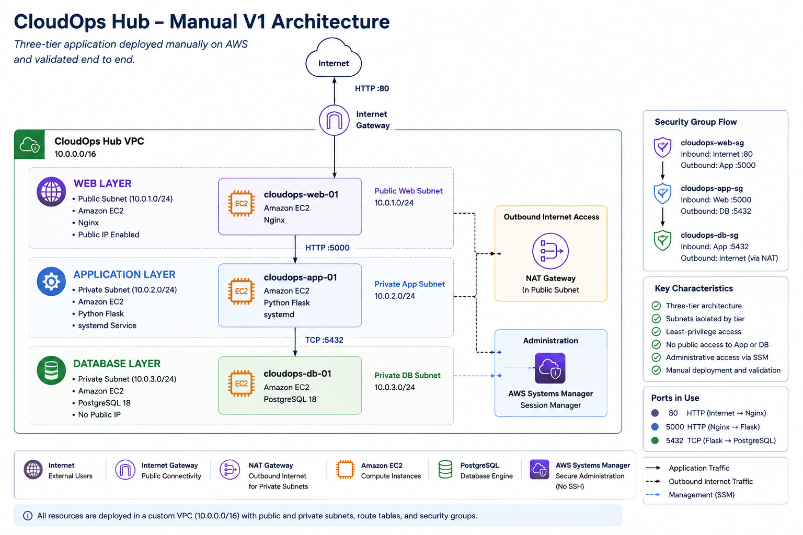
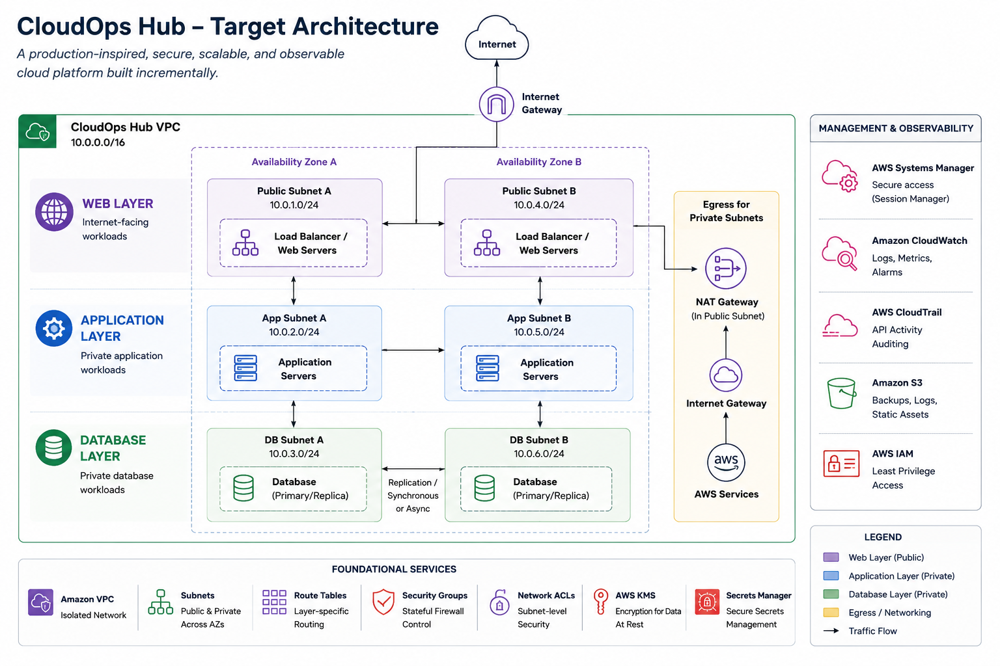

# ☁️ CloudOps Hub

> A production-inspired cloud engineering project built from first principles.

CloudOps Hub is a hands-on AWS project where I am learning how cloud platforms are designed, built, operated, troubleshot, and eventually automated.

Instead of starting with AWS services, I start with the engineering problem, understand the principle behind it, build the solution manually, validate it, troubleshoot it, and only then introduce automation.

---

## 🎯 Goal

The goal is not to memorize AWS services.

The goal is to understand:

- Why cloud services exist
- What problems they solve
- What trade-offs they introduce
- How production systems are designed and operated

```text
Learn the Problem
        ↓
Understand the Principle
        ↓
Design
        ↓
Build
        ↓
Validate
        ↓
Troubleshoot
        ↓
Automate
        ↓
Improve
```

---

## 🏗️ Current Architecture (Manual V1)



CloudOps Hub V1 implements a three-tier AWS architecture:

- **Web Layer:** Amazon EC2 + Nginx
- **Application Layer:** Amazon EC2 + Python Flask
- **Database Layer:** Amazon EC2 + PostgreSQL
- **Administration:** AWS Systems Manager Session Manager
- **Network Security:** Security Group controlled communication between tiers

---
## 🔭 Target Architecture



CloudOps Hub will evolve incrementally toward a highly available,
automated, observable architecture as later phases are implemented.

---
## ✅ Manual V1 Completed

CloudOps Hub V1 has been deployed and validated manually.

### Infrastructure

- Custom VPC
- Public and Private Subnets
- Internet Gateway
- Route Tables
- NAT Gateway
- Security Groups
- AWS Systems Manager

### Database Layer

- Amazon Linux EC2
- PostgreSQL 18
- SCRAM Authentication
- Private Database Server
- Application Schema

### Application Layer

- Python Flask Backend
- PostgreSQL Integration
- REST API Endpoints
- systemd Service Management

### Web Layer

- Nginx
- Reverse Proxy
- Static Frontend
- Browser-to-Database Validation

### Validation

Successfully validated:

```text
Browser
   ↓
Nginx
   ↓
Flask
   ↓
PostgreSQL
   ↓
Data Persistence
```

---

## 📚 Documentation

### Engineering Principles

- [Cloud Engineering Foundations](docs/engineering-principles/01-cloud-engineering-foundations.md)
- [Automation and Safe Delivery](docs/engineering-principles/02-automation-and-safe-delivery.md)

### Infrastructure Foundations

- [VPC Networking Foundation](docs/networking/vpc-foundation.md)
- [Database Foundation](docs/database/database-foundation.md)
- [Application Foundation](docs/application/application-foundation.md)
- [Web Foundation](docs/web/web-foundation.md)

### Operations

- [Manual V1 Deployment Runbook](docs/runbooks/manual-v1-deployment.md)

---

## 🚧 Project Roadmap

### Phase 1 — Manual Deployment ✅

Build everything manually to understand how the platform works.

### Phase 2 — Shell Scripting 🔜

Automate repetitive deployment tasks using Bash scripts.

### Phase 3 — Configuration Management

Introduce Ansible.

### Phase 4 — Infrastructure as Code

Introduce Terraform.

### Phase 5 — Containers & Orchestration

Docker and Kubernetes.

### Phase 6 — Observability

Monitoring, logging, dashboards, and alerting.

### Phase 7 — CI/CD

Automated deployment pipelines.

---

## 💰 Learning Environment

CloudOps Hub follows a cost-conscious learning approach.

```text
Build
  ↓
Learn
  ↓
Validate
  ↓
Document
  ↓
Destroy
  ↓
Recreate
```

Infrastructure is regularly destroyed and rebuilt to reinforce learning while minimizing AWS costs.

---

## 🧠 Engineering Philosophy

> Don't learn a tool first. Understand the problem first.

CloudOps Hub focuses on understanding systems, troubleshooting failures, and making engineering trade-offs before introducing automation.

The objective is not to deploy as many AWS services as possible.

The objective is to think, build, troubleshoot, and operate systems like a Cloud Engineer.